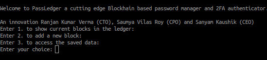
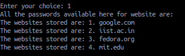
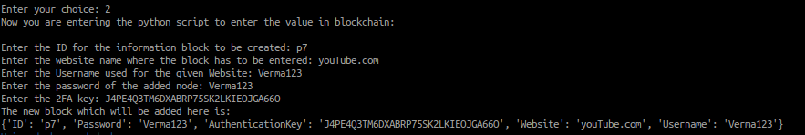
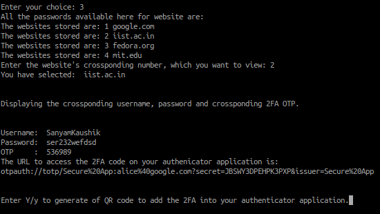

# PassLedger
PassLedger is an innovative, blockchain password manager with 2FA support

#### How to run this code
Copy the contents of the tar file into the fabric sample folder which is created when hyperledger fabric is installed.
##### Steps to be followed after that
1. Download the tar file and untar it.
2. The files used to run the blockchain and the python scripts are already there in the tar file.
3. In the untarred file navigate to /test-network/
4. You can start the the code by running 


```shell
python3 new.py
```

To install the needed packages please run 

```shell 
pip3 install pyotp qrcode matplotlib numpy
```
##### Welcome Screen


##### Option 1 shows all the website's passwords available in database


##### Option 2 to enter the value on the blockchain


##### Option 3 to see password for any website 


##### Option for QR code (you can copy 2FA code in your mobile using this QR code)


